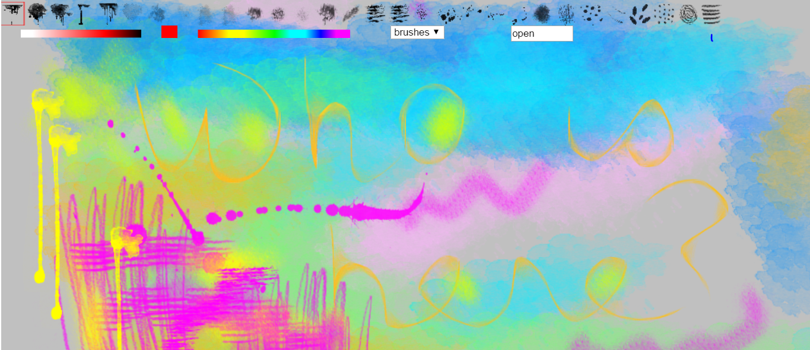

Drawit
======
 
Drawit is an HTML5 canvas drawing app. 

It offers a good selection of paint brushes for artists, including a few of Mr.doob's **harmony brushes**, 
notably sketchy, shaded, and ribbon. It also ports to the  canvas element some **photoshop (PS) brushes**, including some of Alex
Dukal's watercolor, pastel, and grunge brushes, and a few of 
Aramisdream's watercolor brushes.

<!--- ** or _ means boldface 
	unordered list item uses * or + or -, indent items using 2 spaces
	h2 header = underline dashes ----- or ##
	h1 header = underline =====  or #
	>  each line of a block quote (or first and last line)

-->

When you first fire-up drawit, you are presented with a minimialistic drawing surface.  Here's a screenshot of drawit's window, with a sample drawing included.

 On the top row of drawit's window, one finds thumbnails of all the app's photoshop brushes (see screenshot).  On the second row one finds:

+ a color picker;
+ a drop-down menu with all the app's other brushes (including sketchy, shaded, ribbon, and an eraser); and 
+ a text-box which i call the __magic menu__ because it does a lot of stuff while keeping the user-interface clean and simple.
 
	

Getting started
---------------

To begin painting, select any color from the color-picker and then type `b` (without quotes) into the magic menu.  This will immediately add a _background color_ for your painting.

Next select some other color, and select the 6th photoshop brush (a broad watercolor brush) from  the top row. Stroke your canvas with this brush  using either a finger, a stylus, or a mouse. It should be fun!  

There are plenty of other photoshop brushes on the top row for you to  experiment with.

Drawit has  no `undo` or `redo` button. But you can erase back to your background color using the eraser brush.  The width of the eraser brush --- and, indeed, of almost all the non-PS brushes --- can be changed using the magic menu. For example, typing `10` or `20` (without quotes) into the menu will yield a rather large eraser, while typing only `1`, which is the default value, will yield a fine-stroke eraser. I might mention that you also can use the eraser as an ordinary brush, to create some special effects.

 To erase your entire drawing, type `xclear` (without quotes) in the magic menu.  This will clear the canvas back to your background color.  

 I might mention that, at any time, you can change your background color by choosing a different color from the color-picker and then typing `b` in the magic menu.  Changing your background color will not effect any of your artwork, although it is surprising how different your artwork may appear when placed atop a different background color.

<h2>Smudge brushes</h2>

An effect that i enjoy a lot is to rub the canvas with my finger,  to 'smudge up' my lines. (I have a touch screen.) Both the 8th and the 13th photoshop brushes are quite delicate, and work well as smudge brushes. 

This is just a personal observation.  If you like drawing, you'll find your own expressive pathways.

## Saving your work

Like Mr.doob's harmony, when you exit the app, drawit will *automatically* save the current state of your drawing (both background color and artwork) into your computer's `localStorage`.Thus you can resume whenever you please.  This applies only if your computer supports localStorage, as most do, but not ipads.

You also can  **save** your drawing (both background and artwork) to your computer's hard disk by typing `save` (without quotes) into the magic menu. This will automatically open a new window with your drawing. From here you can right-click to open the context menu, and then select the 'save image as...' option from the menu.  Something like this should work even on ipads.  By default, canvas art is saved in the .png format. 

For ipads, saving to hard-disk has the drawback that your background color is 'hard baked' into your drawing; you  no longer can change it.  To mitigate this, drawit allows you to type `store` instead of `save` in the magic menu.  This will store your background color as a cookie, and only save your artwork (without a background color) to your hard disk.  
When you resume, you'll see your old background color. Then, by typing `open` in the magic menu, you can open your saved artwork from your hard disk.  Now you can resume, and also change your background color if you  want.

Typing `open` in the magic menu can be useful even on non-ipad computers:  it permits you to add any image on your hard disk to the main canvas. This is how i included the drawing in the screenshot.

<h2>Try it in full-screen mode</h2>

 I find that using drawit with the browser set to <b>full screen</b> is the most fun because it offers the most immersive experience.   

In google chrome, full-screen mode is toggled by pressing `F11`.

<h2>An issue with google chrome</h2>

  Some web browsers, notably google chrome --- but apparently not firefox or safari, --- object to the canvas's get-image-data method with the terse message in the console:

> "unable to get image data from canvas because the canvas has 
> been tainted by cross-origin data." 

 See  <a href="http://stackoverflow.com/questions/9972049/cross-origin-data-in-html5-canvas">this</a> stackoverflow discussion for more details. A workaround for the problem is to host canvas apps from a web-server. This is relevant to drawit because its photoshop paint brushes (but not its harmony paint brushes) need to access the brushes' image data.

It should be noted that github hosts  drawit via github pags. Hence users  will not experience any _tainted canvas_ messages, which may occur if they try to use drawit directly on  google chrome, without a mediating web-server. 

